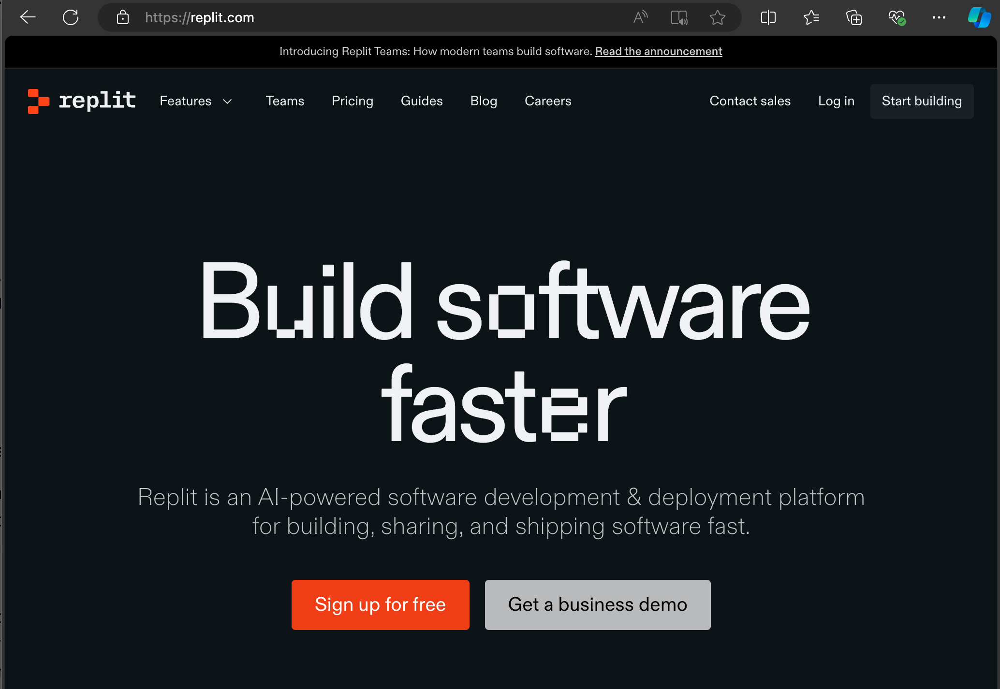
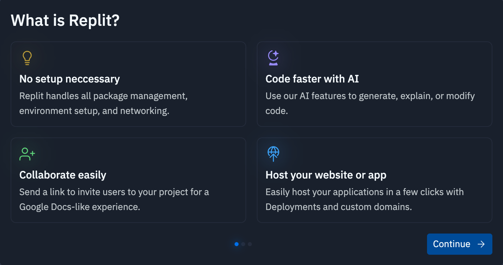
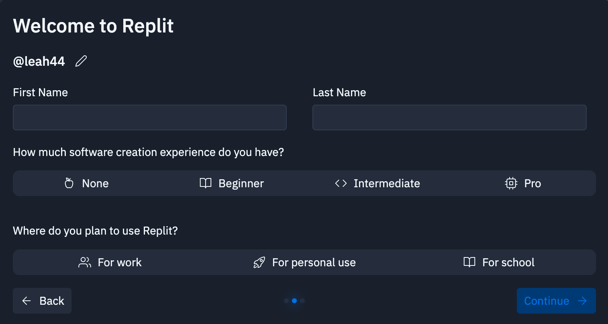
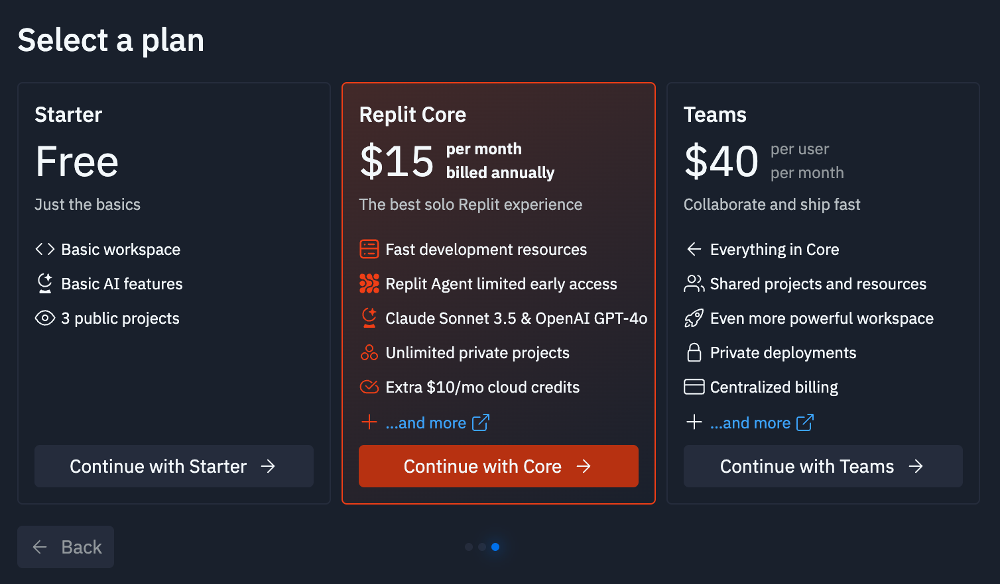
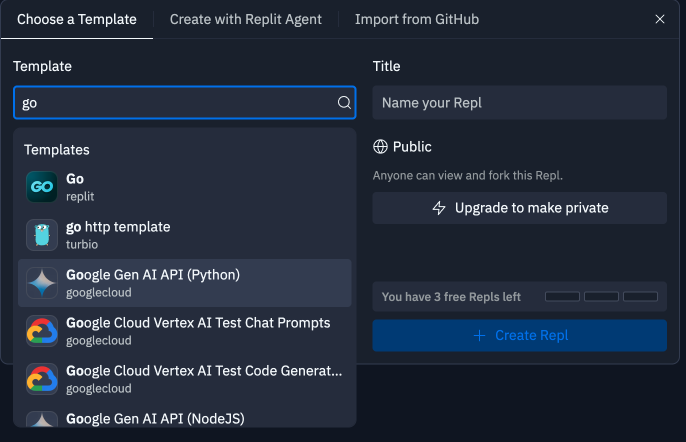
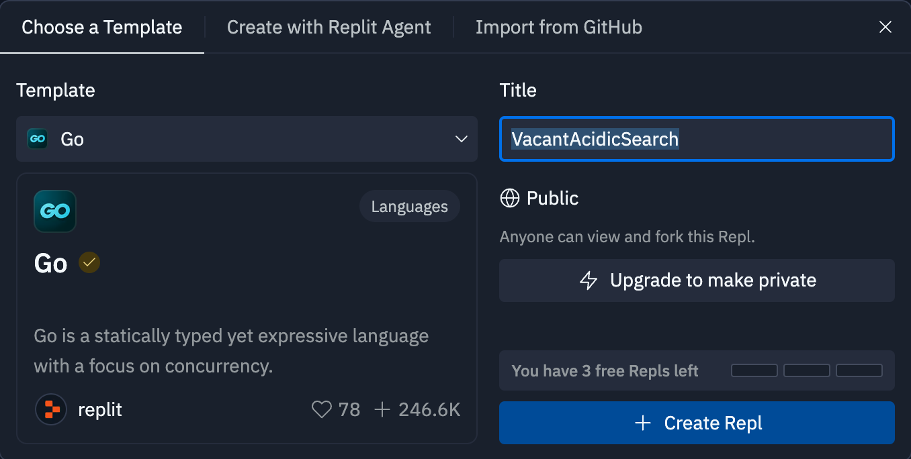
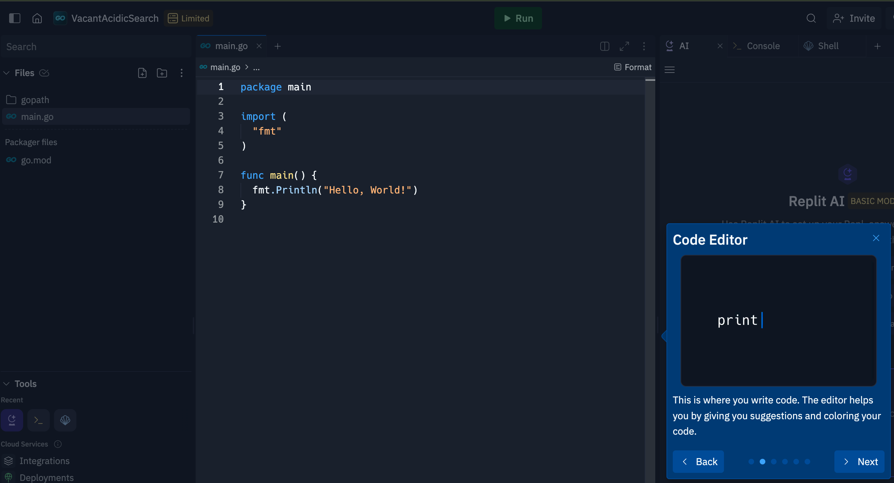
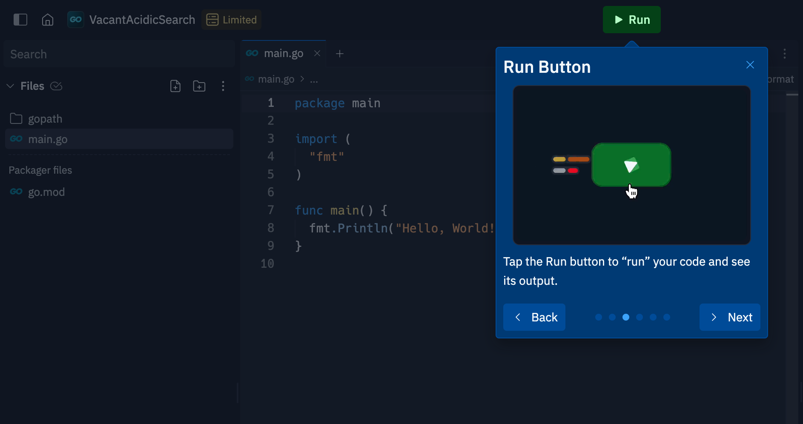
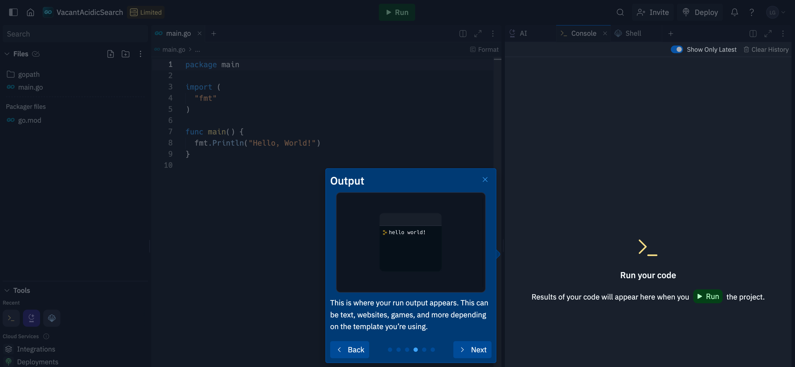

# repl.it

## What is an IDE?
Integrate Development Environment
- editor
- syntax highlighting
- spell check like error detection
- run code

   

## The IDE we will be using
- online IDE
- no installation required
- Uses the same editor as Visual Studio Code

   

## Let's get started
- https://repl.it/
- sign-up

Three page welcome screen
- You can get started writing and running Go code without installing anything locally

- complete details on the welcome screen

- On the third screen select the **Free Plan**

Create Repl

- On the main screen click **Create Repl** to display the **Choose Template** form
- Enter "Go" in the **Template** field and choose "Go" from the list of templates

- A suggested title will be filled in. You can change it. 
- Click **Create Repl** to get started coding!

- Your first Go file will be create. 
- Pop-ups will be displayed to show you around the screen. Here we see the code editor.

- complete details on the welcome screen

- complete details on the welcome screen

   

## The URL where I will be working
https://replit.com/@LeahGarrett?path=folder/2023

You can click open the repl I am working to open it locally. You can copy code or fork it to make your own version

 

   

[Next: 02_hello_world](02_hello_world.md)

