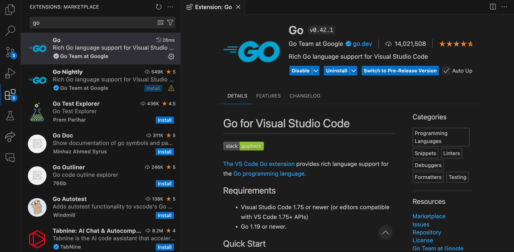

## What is the `mod` file?

replit automatically adds a `go.mod` file for us.

### What is it?
```
Each Go module is defined by a go.mod file that describes the module's properties, including its dependencies on other modules and on versions of Go.  
```
https://go.dev/doc/modules/gomod-ref

```
mod file lists the specific versions of the dependencies that your project uses. The go. sum file provides checksums for the exact contents of each dependency at the time it is added to your module. The dependencies are stored in the Go module cache, which is shared across all projects on your system.
```
https://www.freecodecamp.org/news/golang-environment-gopath-vs-go-mod/#:~:text=mod%20file%20lists%20the%20specific,all%20projects%20on%20your%20system.


<br />

## Setup for the afternoon session

### Install Go on your laptop

Follow the offical guideleines.
Instructions for Linux, Mac and Windows available on this page:  
https://go.dev/doc/install

Verify the install by checking the version:  
`$ go version`
<br>  


### Install an IDE

You can use your own IDE or code editor if you have one installed.

For this course I will be using Visual Studio Code. You can install it here:
https://code.visualstudio.com/download

Add the Go extension for Visual Studio  
https://code.visualstudio.com/docs/languages/go



For more about the extension:  
https://code.visualstudio.com/docs/languages/go


<br />

## Reminder 

The next day's conference is in a different location.
Seymour Centre
Cnr City Road &, Cleveland St, Chippendale NSW 2008
Enter from the stairs near 702 Harris St, next to the Bus Stop.

Be there early (registration starts at 8:30) to ensure they don't miss any of Dave Cheney's keynote.

<br />

[Next: Next Steps in README](/#next-steps)